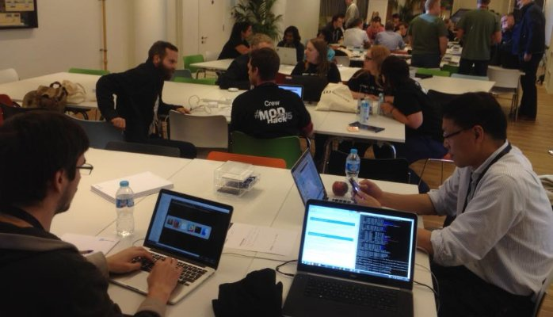
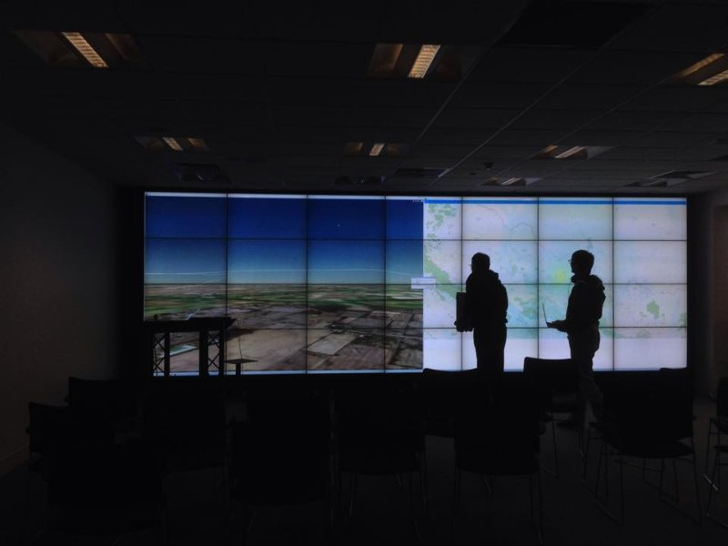
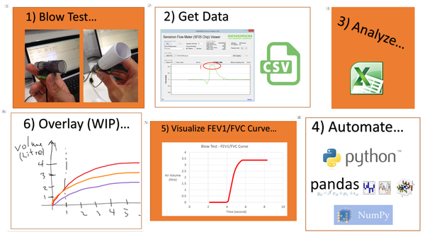
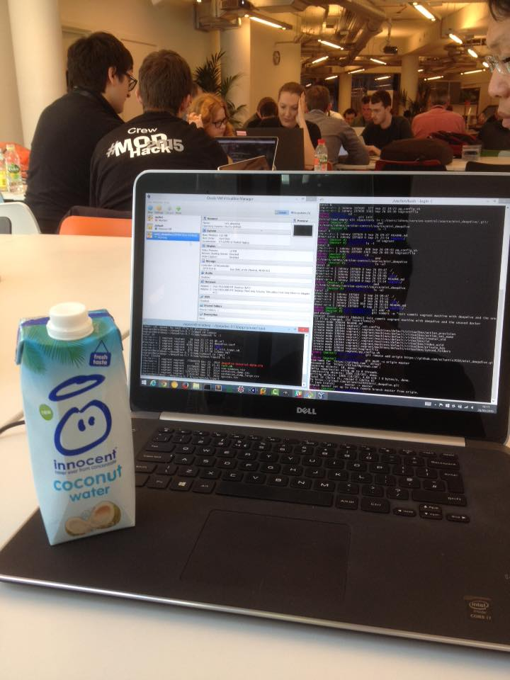
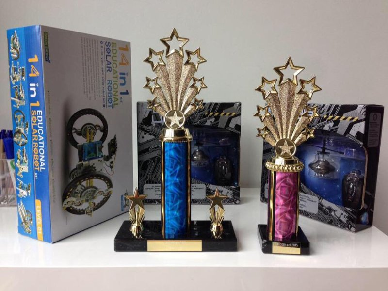

# My Proudest Moment - Winning a Hackathon (with my all-star team)

> Sunday 27th September 2015. Our 3-man Team "Atlantis" was announced runner-up of the Ministry of Defence Hackathon 2015 (#MODHack2015).

This is a story of achieving success in my third hackathon (#MODHack2015), after important "lessons learnt" from my first two hackathons (#Inventorthon, #BreatheHackathon).

# My 1st Hackathon (#Inventhorthon) – we won 3rd place, but where was my contribution?

I attended my first ever Hackathon hosted by Catapult Satellite Application Centre (Oxfordshire) – the theme was “Bring Your Own Disaster” – can we take advantage of satellite technology to help disaster recovery scenario?

By random chance, I teamed up with Charles Cai and Marek Labos – who would later-on become the two most significant persons in my future hackathon life ahead.

A quick brainstorm concluded that our pitch concept would be a “mash drone wifi network” – to provide earthquake survivors with wifi network, in the case all ground telecommunication infrastructure were destroyed.

After 24 hours of research and development, here was what the team got:

- Charles successfully wired up and programmed some physical prototypes resembling the drone wireless communication network, along with a 3D “pilot view” of the drones. (Amazing stuff...)
- Marek successfully created a web application showing a map of the disaster zone, with an overlay of a simulated mash drone wifi network. (Ultra professional stuff...)
- Now the dreadful part… I tried and failed in many things: implementing the suggested tools like the NASA Crisis Mapping ToolKit, Google Earth Engine, Virtualizing a node.js environment with Vagrant, etc. Though I learnt a lot, I did not feel I contributed much to the overall project. I guess I spent too much time making mistakes and not delivering!

Owing to Charles's and Marek's effort, the pitch won 3rd place of the competition. Though I was ashamed. I felt bad - because I knew I could have done better. I could have contributed more.

I covered my heart and said to myself: “next time, I WILL contribute. Somehow.”

# My 2nd Hackathon (#BreatheHackathon) – I contributed. Very Happy. Didn't win. But that didn't matter.

Absorbing lessons learnt previously, I attended the second hackathon: Breathe Hackathon hosted by Imperial College Advanced HackSpace – an event aiming to helping solving the COPD (Chronic Obstructive Pulmonary Disease) issue global-wide.

# My 3rd Hackathon (#MODHack2015) – I contributed. Won 2nd Place! Ultra-happy! Proud.

Then there was this Hackathon hosted by Ministry of Defence (MOD) and Knowledge Transfer Network (KTN) – the theme was “Mining the Deep Web”: can we mine the 95% un-indexed web contents to help making the world a better and safer place?

Purely by chance, I met Charles and Marek again on the day. And naturally, we formed a team again.

Being extra conscious that this time I must contribute, I did some extra planning prior arriving the event – including spending few days studying and installing a suggested open-source tool called “DeepDive” (developed by Standford Hazy Research Group) – which has the capability to extract entity relationship information from tons of pre-processed texts.

This time, I focused. I spent the entire day learning, implementing, and iterating a DeepDive tutorial. I also shared any lessons learnt with Charles and Marek on regular basis for inspiration purposes.

The end result: by the end of Saturday, I became “the DeepDive expert” of the team, and successfully delivered some concrete results from sample data.

I also enhanced the DeepDive source code a little bit on GitHub – what an excitement learning that my code change got accepted and merged into the DeepDive GitHub repository!

I contributed and I delivered. Win or lose, it didn’t matter to me anymore.

# The Winning

And came the surprise, our 3-men team was announced winning the following in the #MODHack2015 :

- The best use of MEMEX (Standford DeepDive) tool award
- Leanest Team award
- Overall Runner-up award

And that, was my proudest moment.

